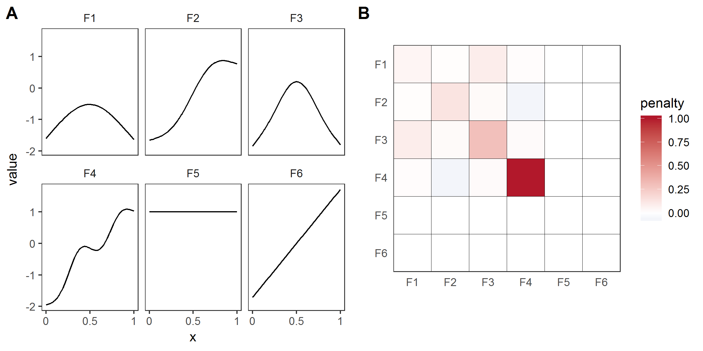

#II: and introduction to Generalized Additive Models

One of the most common model formulations in statistics is the generalized linear model [@McCullagh:1989ti] --- models that relate some response ($y$) to linear combinations of explanatory variables. We may allow allow the response to be distributed according to some exponential family distribution (e.g., letting the response be a trial, a count or a strictly positive number -- binomial, Poisson or Gamma distributions, respectively). The generalized additive modelling (GAM) framework [@Hastie:1990vg; @Ruppert:2003uc; @Wood:2006vg] allows the relationships between the explanatory variables (henceforth covariates) and the response to be described by smooth terms (usually *splines* [@deBoor:1978wq], but potentially other structures). In general we are then talking about models of the form:

$$
\mathbb{E}\left( y \right) = g^{-1}\left( \beta_0 + \sum_{j=1}^J f_j(x_j) \right),
$$

where $y$ is the response (with an appropriate distribution and link function $g$), $f_j$ is a smooth function of the covariate $x_j$, $\beta_0$ is an intercept term and $g^{-1}$ is the inverse link function. Here there are $J$ smooths and each is a function of only one covariate, though it is possible to construct smooths of multiple variables.

Each smooth $f_j$s is represented by a sum of simpler *basis functions* ($b_k$) multiplied by corresponding coefficients ($\beta_k$), which need to be estimated to be estimated:

$$
f_j(x_j) = \sum_{k=1}^K \beta_k b_k(x_j),
$$

The size of $K$ of each smooth will determine the flexibility of the resulting term (referred to as "basis size", "basis complexity" or "basis richness"). Though it seems like the basis can be overly complex ("how big should I make $K$?") and lead to overfitting, we need not worry about this as we use a penalty to ensure that the functions complexity is appropriate; hence the basis only need to be "large enough" and we let the penalty deal with excess wigglyness.

The penalty for a term is usually based on derivatives of that term -- as the derivatives give the wigglyness of the function and hence its flexibility. We trade-off the fit of the model against the wigglyness penalty to obtain a model that both fits the data well but does not overfit. To control this trade-off we estimate a *smoothing parameter*. Figure \ref{fig:smoothing_effect} shows optimal smoothing (where the smoothing parameter is estimated to give a parsimonious model) in the first plot; the second plot shows what happens when the smoothing parameter is set to zero, so the penalty has no effect (interpolation); the right plot shows when the smoothing parameter is set to a very large value, giving a straight line. Smooths of this kind are often referred to as a *basis-penalty smoothers*.

**say something about knots!**


**say something about penalty matrices and also smoothing parameters**

```{r lambda, echo=FALSE, message=FALSE, results='hide', fig.width=6, fig.height=3, cache=TRUE, fig.cap="\\label{fig:smoothing_effect}Examples of how different choices of the smoothing parameter effect the resulting function. Data (points) were generated from the blue function and noise added to them. In the left plot the smoothing parameter was estimated to give a good fit to the data, in the middle plot the smoothing parameter was set to zero, so the penalty has no effect and the function interpolates the data, the right plot shows when the smoothing parameter is set to a very large value, so the penalty removes all terms that have any wigglyness, giving a straight line. Numbers in the $y$ axis labels show the estimated degrees of freedom for the term.", messages=FALSE, dev=c('pdf')}
# example of varying lambda

library(mgcv)
set.seed(12)

# generate some data
dat <- gamSim(1, n=100, dist="normal", scale=2)
dat$y <- dat$y - (dat$f1 + dat$f0 + dat$f3)
dat$x <- dat$x2
true <- data.frame(x = sort(dat$x),
                   y = dat$f2[order(dat$x)])

par(mfrow=c(1,3),las=1,mgp=c(2,1,0))

# optimal
b <- gam(y~s(x, k=100), data=dat)
plot(b, se=FALSE, ylim=c(-9,12), cex.lab=1.2)
points(dat$x, dat$y-coef(b)[1], pch=19, cex=0.5)
lines(true$x, true$y-coef(b)[1], type="l", col="blue")

# lambda=0
b.0 <- gam(y~s(x, k=100), data=dat, sp=0)
plot(b.0, se=FALSE, ylim=c(-9,12), cex.lab=1.2)
points(dat$x, dat$y-coef(b.0)[1], pch=19, cex=0.5)
lines(true$x, true$y-coef(b.0)[1], type="l",col="blue")

# lambda=infinity
b.inf <- gam(y~s(x, k=100), data=dat, sp=1e10)
plot(b.inf, se=FALSE, ylim=c(-9,12), cex.lab=1.2)
points(dat$x, dat$y-coef(b.inf)[1], pch=19, cex=0.5)
lines(true$x, true$y-coef(b.inf)[1], type="l", col="blue")
```

The number of basis functions, $K$, limits the maximum basis complexity for a given smooth term. To measure the wigglyness of a given term, we use the *effective degrees of freedom* (EDF) which, at a maximum is the number of coefficients to be estimated in the model, minus any constraints. The EDF can take non-integer values and a larger value indicates a more wiggly term. See @Wood:2006vg Section 4.4 for further details.

There are many possible basis functions that can be used to model the $b_k$s. Here we'll use thin plate regression splines, which have the appealing property that knot choice is somewhat automatic (the best approximation to including knots at each data poiint is used; @wood_thin_2003).


**DLM:: put the cubic splines back in here**

TPRS are also defined for any number of predictors, so multivariate smoothers can be constructed easily. The basis is *isotropic* so smoothing is treated the same in all directions. So if one had, a bivariate smooth of temperature and time, a one degree change in temperature would equate to a one second change in time, which is an odd assumption to make. In the more general case where units are not alike, we can use *tensor products* to combine two or more univariate smooths into a more complex basis. Each component can be made up from a different basis, playing to their particular strengths.

In the linear modelling literature we can specify a single interaction between terms (in R, `a:b`) or a "full interaction", which includes the marginal terms (`a*b` in R, which is equivalent to `a + b + a:b`). There are parallels for smooths too, allowing us to separate-out the main effect terms from the interactions (in R `te(a, b)` specifies the tensor product which is equivalent to `ti(a) + ti(b) + ti(a, b)`). The ability to separate out the interactions and main effects will become very useful in the next section, once we start looking at group-level smooths.

** this plot doesn't get referenced?!**

```{r mackerel-tensor, echo=FALSE, results='hide', fig.width=5, fig.height=5, messages=FALSE, dev=c('pdf'), cache=TRUE, fig.cap="Tensor product of depth and salinity with data taken from a 1992 survey of mackerel eggs. The two left plots show the marginal smooths of each term in the model (`ti(s.depth)` above and `ti(salinity)` below), the right plot shows the interaction effect (`ti(s.depth, salinity)`). Data are from @Wood:2006vg."}
library(mgcv)
library(gamair)

# use the mackerel data example
data(mack)

b <- gam(egg.count~ti(s.depth) + ti(salinity) + ti(s.depth, salinity),
         family=tw(), data=mack)

layout(matrix(c(1,2,3,3), 2, 2), widths=c(1.5,1.5,1), height=c(1,1,2))
par(mar=c(4, 3, 1, 2) + 0.1)
plot(b, select=1)
plot(b, select=2)
par(mar=c(0, 0, 0, 0) + 0.1)
vis.gam(b, view=c("s.depth","salinity"), theta=-60, phi=30, color="bw")
```

We represent the terms in our model as basis functions, which end up as additional columns in our design matrix and parameter vector, and penalties, which penalize the likelihood and stop our model from being too wiggly. Taking a pragmatic Bayesian approach to the problem, the penalty is really a prior on how we think the model should act. In which case the penalty matrix itself is a prior precision matrix (inverse variance) for the term. With that in mind, we can think about random effects as "smooths" in our model, albeit ones with with ridge penalies (CITE). For instance, to include a random effect modelling between group variation in intercepts there will be one basis function for each level of the grouping variable, that takes a value of 1 for any observation in that group and 0 for any observation not in the group. The penalty matrix for these terms is a $n_g$ by $n_g$ identity matrix, where $n_g$ is the number of groups. This means that each group-level coefficient will be penalized in proportion to its squared deviation from zero. This is equivilent to how random effects are estimated in standard mixed effect models. The penalty term here is proportionate to the inverse of the variance of the fixed effect estimated by standard hierarchical model solvers [add citation here  does this contradict what's above??].

This connection between random effects and basis function smooths extends beyond the varying-intercept case. Any basis-function representation of a smooth function can be transformed so that it can be represented as a random effect with an associated variance. While this is beyond the scope of this paper, see @wood_straightforward_2012 for a more detailed discussion on the connections between these approaches.


### Smoothing penalties vs. shrinkage penalties

**does this go above??**

Penalties can have two effects on how well a model fits: they can penalize how wiggly a given term is (smoothing) and they can penalize the absolute size of the function (shrinkage). The penalty can only effect the components of the smooth that have derivatives (the *range space*), not the other parts (the *nullspace*). For 1-dimensional thin plate regression splines, this means that there is a linear term left in the model, even when the penalty is in full force (as $\lambda \rightarrow \infty$), as shown in figure **BLAH**. It is often useful to be able to remove nullspace functions as well, to be able to shrink them to zero if they do not contribute significantly to a given model fit. This can be done either by tweaking the penalty matrix so that it both smooths and shrinks as the single penalty term increases, or by adding a new penalty term that just penalizes the null space for the model. Figure \ref{fig:basis_example} shows an example of what the basis functions (Fig. \ref{fig:basis_example}A), and smoothing penalties and shrinkage penalties (Fig. \ref{fig:basis_example}B) look like for a 6-basis function cubic spline and for a 6-basis function thin-plate spline. The random effects smoother we discussed earlier is an example of a pure shrinkage penalty; it penalizes all deviations away from zero, no matter the pattern of those deviations.


**DLM: say something about cs basis here**

**EDIT this figure**



## Comparison to hierarchical linear models

Generalized linear mixed effect models [GLMMs; also referred to as hiearchical generalized linear models, multilevel models etc; e.g., @Bolker:2009cs; @Gelman:2006jh] are an extension of regression modelling that allow the modeller to include structure in the data -- the structure is usually of the form of a nesting of the observations. For example individuals are nested within sample sites, sites are nested within forests and forests within states. The depth of the nesting is limited by the fitting procedure and number of parameters to estimate.

HGLMs are a highly flexible way to think about groupings in the data, the groupings used in the models often refer to the spatial or temporal scale of the data [@McMahon:2007ju] though can be based on any useful grouping.

We would like to be able to think about the groupings in our data in a simple way, even when the covariates in our model are related to the response in a non-linear way. The next section investigates the extension of the smoothers we showed above to the case where each observation is in a group, with a group-level smooth.


** this last section should say something like: these are both latent gaussian thingos, the model structure is the difference -- we want to be able to heirarchically structure our smoothers**
