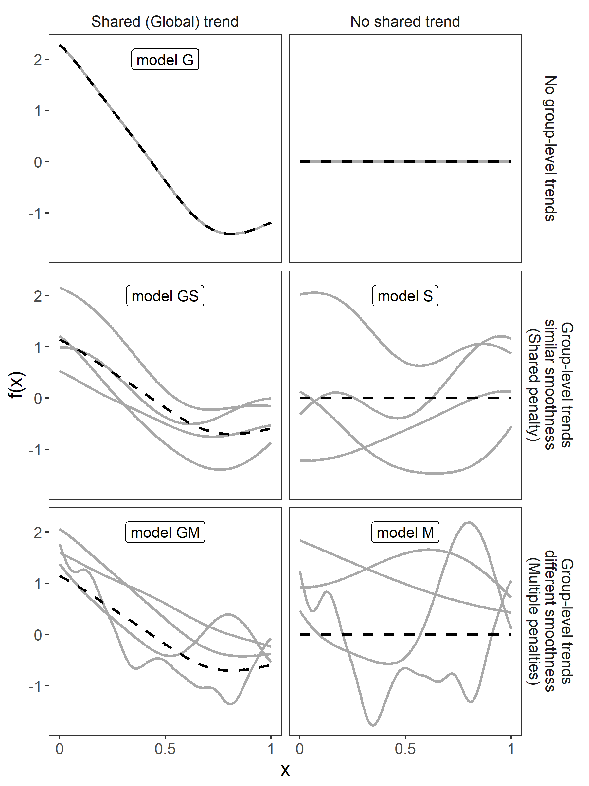

---
output:
  pdf_document: default
  html_document: default
---

# What do we mean by hierarchical smooths?

The smoothers we went over in section II allowed us to model nonlinear relationships between our **x** and **y** variables. In this section, we will cover the different ways to adapt those smooths to model inter-group variability in smooth curves and how to fit the different models in `mgcv`.

When modelling hierarchical smooths in `mgcv`, there are three broad choices to make:

1. Should each the functional relationship between x and y for each group have its own smooth, or will a global smooth term suffice? 

2. Do all of the group-specific curves have similar smoothness to one another, or should each group have its own smoothness penalty?

3. Will the different smooth functions for each group have a similar shape to one another? That is, there a shared global average curve?


The combination of these three questions results in five possible models (figure *models*) beyond the null model of no functional relation between **x** and **y**:

1. A single common smooth function for all observations.

2. A single common smooth function plus group-level functions that are all similarly smooth to one another.

3. A single common smooth plus group-level functions that vary in smoothness from one another.

4. Group-specific smooth functions without an average trend, but with all functions being similarly smooth.

5. Group-specific functions that differ in smoothness. 




We will discuss the trade-offs between different models and  guidelines about when each of these models is appropriate in section IV. The remainder of this section will focus on how to model each of these five models using `mgcv`. 

# Coding hierarchical GAMs in R

**EJP: Going with canned and simulated data for the examples rather than real as it's a bit less messy**

Each of these models can be coded straightforwardly in `mgcv`. To help illustrate this throughout the section when describing how to set these models up, we will refer to outcome variables as **y**,  continuous predictor variables as **x** (or **x1** and  **x2**, in the case multiple predictors), and **fac** to designate the discrete grouping factor whose variation we are interested in understanding.

We will also use two example datasets to demonstrate how to code these models, one real and one simulated (see the appendix for code to generate these examples):

A. The CO2 dataset, available in R in the *datasets* package (loaded by default). This data is from an experimental study by CITE of $CO_2$ uptake in grasses under varying concentrations of $CO_2$, measuring how concentration-uptake functions varied between plants from two locations (Mississippi and Quebec) and two temperature treatments (chilled and warm). A total of 12 plants were measured, and uptake measured at 7 concentration levels for each plant. Here we will focus on how to use these techniques to estimate inter-plant variation in functional responses. 

B. A hypothetical study of bird movement along a migration corridor. This dataset consists of records of numbers of observed locations of 100 tagged individuals each from six species of bird, at ten locations along a latitudinal gradient, with one observation taken every four weeks. Not every bird was observed at each time point, so counts vary randomly between location and week. The data set (bird_move) consists of the variables `count`, `latitude`, `week` and `species`. This example will allow us to demonstrate how to fit these models with interactions and with non-normal (count) data. 

One important point to note here before digging into the code is that the grouping variable used should be coded in R as an unordered factor vector when used in one of these models in `mgcv`. A character vector will raise an error when passed to any of the smooths discussed here or to a `by` term (used in model 3 and 5 below). If the grouping variable is numeric (i.e. groups were coded as 1,2,3, etc. in the data), it will be treated as a linear predictor and will not give proper group-wise predictions. Whether the factor is ordered or not[^ord_note] will not matter for most of the smoothers we use here. However, for models 3&5, where group-level smooths are coded using the `by=fac` argument in the `s()` function, order will matter; if the factor is unordered, `mgcv` will set up a model with one smooth for each grouping level. If the factor is ordered, `mgcv` will not set the basis functions for the first grouping level to zero. In model 3 (with an ungrouped smooth included) the ungrouped smooth will then correspond to the first grouping level, rather than the average functional response, and the group-specific smooths will correspond to deviations from the first group. In model 5, using an ordered factor will result in the first group not having a smooth term associated with it at all.

[^ord_note]: The levels of an ordered factor can be explicitly ranked, even if they cannot be assigned precise numerical values. For instance, an ecosystem assessment where lakes are coded as "healthy", "marginal", and "unhealthy" is ordered. An unordered factor cannot be given a ranking. For example, a factor recording the color of the lakes ("brown", "green", or "clear"). Typically, group ids in hierachical models are assumed to be unordered. 


## A single global smooth term (model 1)

 This is the typical GAM setup, with a single smooth term for each variable. Specifying the model is similar to specifying a `glm` in R. One-dimensional or isotropic multidimensional smooth terms are specified with a function named `s()`. The first arguments (given without names) are the terms to be smoothed over. The type of smooth to be used for the term is specified by writing `bs=<basis name>`, and the number of basis functions is specified by `k=<number of functions>`. The `s()` function will also take additional arguments, depending on the type of smooth. Both `bs` and `k` have default values; `bs` defaults to a thin-plate spline (`bs="tp"`) and `k` defaults to a value determined by the type of smoother (`k=10` by default for `bs="tp"`). See the documentation in `mgcv` for more details on specifying smooth terms, with `?mgcv::s` and `?mgcv::smooth.terms`. For a given `gam` model, you can have an arbitrary number of smooth terms, connected by putting `+` between each `s()` function. This is equivalent to including linear terms without interactions in a standard `glm` model. Models like this look like `y~s(x)` for a simple smooth relationship between **x** and **y** or `y~s(x)+s(fac, bs="re")`, to model both a global smooth relationship between **x** and **y** and between-group variation in intercepts (modelled with a random effect smoother).

For our CO2 data set, we will use two basic smooth terms: a thin plate spline to model the average functional relationship between $CO_2$ concentration and uptake, and a simple random effect smoother for species to model species-specific intercepts [^mult_note] [^reml_note]. 

[^mult_note]:Note that we're actually modelling ln(uptake); this can be a useful approach when dealing with estimating multiple functional relationships as it means that functions that differ from each other by a multiplicative constant (so $f_1(x) = \alpha\cdot f_2(x)$ will differ by an additive constant when log-transformed (which can be estimated by simple random effects): $ln(f_1(x)) = ln(\alpha)+ ln(f_2(x))$. We have also ln-transformed concentration. Since the concentration-uptake relationship changes rapidly at low concentration values and slowly at higher values, estimating the relationship without log-transforming it can lead to a small estimated penalty value, and an overly wiggly function at higher concentration values.)

[^reml_note]: Here we have specified `method="REML"`. This tells `mgcv` to use Restricted Maximum Likelihood [CITE] to estimate model coefficients and penalty terms. We strongly recommend using either `method="REML"` or `method="ML"` (marginal likelihood) when fitting models, as the default `method="GCV.Cp"` is not as consistent at estimating smoothing penalties as the likelihood-based methods and tends to substantially under-smooth terms [CITE]. 


```{r co2_mod1, echo=TRUE,  fig.width=6, fig.height=3, message=FALSE, warning=FALSE, cache=FALSE}
library(mgcv)
library(ggplot2)

#The default CO2 plant variable is ordered; 
#This recodes it to an unordered factor (see above for why). 
CO2 = transform(CO2, Plant_uo = factor(Plant, ordered = FALSE))

CO2_mod1 = gam(log(uptake) ~ s(log(conc), k = 5, bs = "tp") +
                   s(Plant_uo, k = 12, bs = "re"), 
               data= CO2,method="REML")

plot(CO2_mod1, pages = 1, seWithMean = TRUE)
```

This shows how to fit the model, and shows the default plot for the model for `mgcv`. The plot has two panels: the first showing the estimated global functional relationship, and the second showing the estimated distribution of random effects for the plant-specific intercepts.

The next block of code shows how you could plot this to illustrate inter-plant variation in the functional response with estimated functional variability, plotting untransformed uptake and concentration to make the figure easier to comprehend. You can see the effect log-transforming concentration has on model fits; even though plants Mc1 -- Mc3 show a much flatter response in untransformed space, the same functional response fits relatively well after accounting for the random effect (a multiplicative difference between functional responses).


```{r co2_mod1_ggplot, echo=TRUE,  fig.width=6, fig.height=3, message=FALSE, warning=FALSE, cache=TRUE}
newconc <- with(CO2,
                expand.grid(conc = seq(min(conc), max(conc), length = 100),
                            Plant_uo = levels(Plant_uo)))
CO2_mod1_pred <- cbind(newconc, predict(CO2_mod1, newconc, se.fit = TRUE))

ggplot(data = CO2, aes(x = conc, y = uptake, group = Plant_uo)) +
    facet_wrap(~ Plant_uo) +
    geom_point() +
    geom_line(aes(y = exp(fit)), data = CO2_mod1_pred) +
    geom_ribbon(aes(ymin = exp(fit - 2*se.fit), ymax = exp(fit+ 2*se.fit), x = conc),
                data = CO2_mod1_pred, alpha = 0.3, inherit.aes = FALSE)
```	

Global smooth models with interactions are also straightforward to model. For isotropic smooths such as thin-plate splines, extra terms can simply be added to the `s()` function (`y~s(x1,x2)`). For non-isotropic smooths, we use the tensor product (`te()`) function. It is specified similarly to the `s()` function, but requires additional information to specify the types of basis and number of basis functions used for each marginal term. `bs` can be specified as a single value, in which case that basis is used for all marginal terms in the model. `k` can also be given as a single value, and works similar to `bs`. For example, `y~te(x1,x2, k=c(10,5), bs=c("tp","cs"))`, would specify a non-isotropic smooth of **x1** and **x2**, with the marginal basis for **x1** being a thin-plate spline with 10 basis functions, and **x2** having  a cubic regression spline with a penalty on the null space. As with `s()`, the user can also give `te()` more options depending on the basis types used. For more information, consult `?mgcv::te`.

For our bird example, we will use one smooth term, a tensor product of latitude and week. We will use using a 10 basis function thin plate spline for the marginal latitude effects, and a 10 basis function cyclic cubic spline for the marginal week effect to account for the cyclic nature of weekly effects (we expect week 1 and week 52 to have very similar values). We will also assume the date (counts of individuals at each location in each week) follow a Poisson distribution. For simplicity of code we will exclude a species-specific random effect like the one we had in the $CO_2$ uptake example[^sp_ranef_note].

[^sp_ranef_note]:If we included it, it could be interpreted as modelling variation in average observability between species. However, as we cheated and know what the data generating process looks like, we do not need to worry about adding it here. 

Note that the total number of basis functions used for a given smooth is the product of the marginal `k` values, so in this example the global smooth would have 99 parameters (10*10, minus one to account for the presence of the global intercept). It will also have two smoothing parameters estimated; one for each marginal basis (week and latitude).

```{r bird_mod1, echo = TRUE,  fig.width = 4, fig.height = 4, message = FALSE, warning = FALSE, cache = TRUE}
library(tidyr)
library(viridis) # for color plotting

bird_move = read.csv("../data/bird_move.csv") # load data

bird_mod1 = gam(count ~ te(week, latitude, bs = c("cc", "tp"), k = c(10, 10)), 
                data = bird_move, method = "REML", family = poisson)

plot(bird_mod1, pages = 1, scheme = 2, rug = FALSE)
box()
```

The default plot for this GAM illustrates the average log-abundance of all bird species at each latitude for each week, with yellow colours indicating more individuals and red colours fewer. This graph implies that these birds are starting at low latitudes in the winter then migrating to high latitudes from the 10th to 20th week, staying there for 15-20 weeks, then migrating back. However, the plot also indicates a large amount of uncertainty in the timing of migration. The source of this variability is apparent when the migration timing of each species is plotted in conjunction with the model fit:

```{r bird_mod1_ggplot, echo = TRUE, fig.width=8, fig.height=3, message=FALSE, warning=FALSE, cache=TRUE}
bird_move = transform(bird_move, mod1 = predict(bird_mod1, type = "response"))
#gets the fitted model values, at the response scale

bird_move_plot = gather(bird_move, key = model, value = value, count, mod1)
#combines observed and fitted estimates into a single column called "value"

ggplot(bird_move_plot, aes(x = week, y = latitude, fill = value)) +
    geom_raster() +
    facet_grid(model ~ species)+
    scale_fill_viridis() +
    scale_x_continuous(expand = c(0,0), breaks = c(1,26,52)) +
    scale_y_continuous(expand = c(0,0), breaks = c(0,30,60)) +
    labs(fill = "Individuals")
```


Here the top row denotes the observed counts of each species (with color indicating abundance in that location in that week), and the bottom indicates the model fit. All six species show relatively precise migration patterns, but they differ in the timing of when they leave their winter grounds and the time they spend at their summer grounds. Averaging over all of this variation results in a relatively imprecise (diffuse) average estimate of migration timing (bottom row). This model could potentially be improved by adding inter-group variation in migration timing. The rest of this section will focus on how to model this type of variation. 


##Global function plus group-specific functions with similar smoothness (Model 2)


The second type of model is a close analogue to a GLMM with varying slopes. This class of model assumes that all groups will have similar functional responses, but allows for inter-group variation in responses. This approach works by allowing each grouping level to have its own functional response, but penalizing functions that are too far from the average. 

This can be coded in  `mgcv`by explicitly specifying one term for the global smooth (as in model 1 above) then adding a second smooth term specifying the group level smooth terms, using a penalty term that tends to draw these group-level smooths to zero[^mrf_note]. For one-dimensional smooths, `mgcv` provides an explicit basis type to do this, the factor smooth or "fs" basis (see `?smooth.construct.fs.smooth.spec` for detailed notes). This smoother creates a copy of each set of basis functions for each level of the grouping variable, but only estimates one set of smoothing parameters for all groups. The penalty is also set up so each component of its null space is given its own penalty (so that all components of the smooth are penalized towards zero)[^intercept_note]. As there can be issues of co-linearity between the global smooth term and the group-specific terms (see section V for more details), it is generally necessary to use a smoother with a more restricted null space than the global smooth; for thin plate splines this can be done by setting m=2 for the global smooth and m=1 for the group smooth [cite Wieling paper here]. e.g.: `y~s(x,bs="tp",m=2)+s(x,fac,bs="fs",m=1,xt=list(bs="tp"))`. 

[^mrf_note]: There is another way of coding this type of model, using a type of smoother called a Markov Random Field (MRF) that allows the global smooth and group--level smooth to be combined into a single term, and to model more complicated relationships between groups (such as phylogenies, functional similarities, or nested groupings). However, these smoothers are more complicated to explain, so we will save discussion for how to use them for the appendix (Appendix A). 


[^intercept_note]: As part of the penalty construction, each group will also have its own intercept (part of the penalized null space), so there is no need to add a separate term for group specific intercepts as we did in model 1. 


This is how this approach would be used to model variability in $CO_2$ uptake in the CO2 dataset:

```{r co2_mod2, echo=TRUE,  fig.width=6, fig.height=3,message=F, warning=F, cache=T}
source("../code/functions.R")

CO2_mod2 = gam(log(uptake) ~ s(log(conc),k=5,m=2, bs="tp")+
                  s(log(conc), Plant_uo, k =5,  bs="fs",m=1), 
                data= CO2,method="REML")

plot(CO2_mod2,page=1, seWithMean = T)
```


The above plot shows the global function (left) and group-specific deviations from the global function (right) for `CO2_mod2`. The plots of group--specific smooths indicate that plants differ not only in average log-uptake (which would correspond to each plant having a straight line at different levels for the group-level smooth), but differ slightly in the shape of their functional responses. The plot below shows how the global and group--specific smooths combine to predict uptake rates for individual plants:

```{r co2_mod2_ggplot, echo=TRUE,  fig.width=6, fig.height=3,message=F, warning=F, cache=T}
CO2_mod2_pred = predict(CO2_mod2,se.fit = T)
CO2$mod2 = CO2_mod2_pred$fit
CO2$mod2_se = CO2_mod2_pred$se.fit

ggplot(data=CO2, aes(x=conc, y= uptake, group=Plant_uo))+
  facet_wrap(~Plant_uo)+
  geom_point()+
  geom_line(aes(y=exp(mod2)))+
  geom_ribbon(aes(ymin=exp(mod2-2*mod2_se), 
                  ymax=exp(mod2+2*mod2_se)),alpha=0.25)
```


The "fs"-based approach mentioned above does not work for two or higher-dimensional smooths. Instead, the group-specific term can be specified with a tensor product of the continuous smooths and a random effect for the grouping parameter. This term will again have a separate set of basis functions for each group, one penalty for the smooth term, and a second penalty drawing all basis functions toward zero[^fs_note]. e.g.: `y~te(x1,x2,bs="tp",m=2)+te(x1,x2, fac,bs=c("tp","tp","fs"),m=1)`. We illustrate this approach below on the bird migration data.

[^fs_note]: Note that this differs from the "fs" penalty, which assigned one penalty per null space term.

```{r bird_mod2, echo=TRUE,  fig.width=4, fig.height=4, message=F, warning=F, cache=T}
bird_mod2 = gam(count ~ te(week,latitude, bs= c("cc", "tp"), 
                           k=c(10,10),m=c(2,2))+
                  te(week,latitude,species, bs= c("cc", "tp","re"), 
                     k=c(10,10,6),m = c(1,1,1)), 
                data= bird_move, method="REML", family= poisson)

plot(bird_mod2, page=1, scheme=2,rug = F, seWithMean = T)

```


```{r bird_mod2_ggplot, echo=TRUE,  fig.width=8, fig.height=3, message=F, warning=F, cache=T}
bird_move$mod2 = predict(bird_mod2,type ="response")

bird_move_plot2 = gather(bird_move, key = model, value = value, count, mod2)

ggplot(data=bird_move_plot2, aes(x=week, y=latitude, fill = value,color=value))+
  geom_tile(size=1)+
  facet_grid(model~species)+
  scale_fill_viridis("individuals")+
  scale_color_viridis("individuals")+
  scale_x_continuous(expand=c(0,0),breaks = c(1,26,52))+
  scale_y_continuous(expand=c(0,0), breaks=c(0,30,60))
```


## Global function plus group-specific functions with different smoothness (Model 3)

This model class is very similar to model 2; the only change is that we will allow each group-specific smooth to have its own penalty term. This increases the computational cost of the model (more penalties means more computer time in general), and means that the only information shared between groups is through the global smoothing term. It is useful, however, if different groups differ substantially in how variable they are. 

Fitting a seperate smooth term (with its own penalties) can be done in `mgcv` by using
the `by=fac` argument in the `s()` function. Therefore, we can code this model as: `y~s(x,bs="tp") + s(x, by=fac, m=1, bs= "ts") + s(fac, bs="re")`. Note two major differences from how model 2 was specified: first, we explicitly include a random effect for the intercept (the `bs="re"` term), as group-specific intercepts are not incorporated into these smooth terms automatically the way they are when using either a `bs="fs"` smooth or a tensor product random effect smooth. Second, we explicitly used a basis with a fully penalized null space for the group-level smooth (`bs="ts"`, for  "thin plate with shrinkage"), as this method does not automatically penalize the null space, so there is potential for co-linearity issues between unpenalized components of the global and group-level smoothers. 

This model is straight-forward to fit to the `CO2` dataset: 

```{r mod3_CO2, echo=TRUE,  fig.width=5, fig.height=3,message=F, warning=F, cache=T}


CO2_mod3 = gam(log(uptake) ~ s(log(conc),k=5, m=2, bs="tp")+
                  s(log(conc),by= Plant_uo, k=5, bs="ts",m=1)+
                 s(Plant_uo,bs="re",k=12), 
                data= CO2,method="REML")

par(mfrow=c(2,3),mar =c(4, 4,1, 1))
plot(CO2_mod3,scale=0,select=14,ylab = "Intercepts",main=NA)
plot(CO2_mod3,scale=0,select=1, ylab = "global smooth",seWithMean = T)
plot(CO2_mod3,scale=0,select=3, ylab = "Plant Qn1",seWithMean = T)
plot(CO2_mod3,scale=0,select=5, ylab = "Plant Qc1",seWithMean = T)
plot(CO2_mod3,scale=0,select=10, ylab = "Plant Mn1",seWithMean = T)
plot(CO2_mod3,scale=0,select=13,ylab = "Plant Mc1",seWithMean = T)
```

We have just plotted a subsample of the group-specific smooths from this model, to prevent crowding. It is appearent from this that some groups (e.g. Qc1) have very similar shapes to the global smooth (differing only in intercept), others do differ from the global trend, with higher uptake at low concentrations and lower uptake at higher concentrations (e.g. Mc1, Qn1), or the reverse pattern (e.g. Mn1).

Using model 3 with higher-dimensional data is also straight forward; `by=fac` terms work as well in tensor-product smooths as they do with isotrophic smooths. 

```{r mod3_bird, echo=TRUE,  fig.width=5, fig.height=3,message=F, warning=F, cache=T}

bird_mod3 = gam(count ~ te(week,latitude, bs= c("cc", "tp"), 
                           k=c(10,10),m=c(2,2)) +
                  te(week,latitude, bs= c("cc", "tp"), 
                           k=c(10,10),m=c(1,1),by= species), 
                data= bird_move, method="REML", family= poisson)
```


## Models without global smooth terms (models 4 and 5)

It is simple to modify the above models to exclude the global term (and it is generally faster to estimate these models than ones with a global term; see section V). Model 4 (shared smooths) is simply model 2 without the global smooth term: `y~s(x,fac,bs="fs")` or `y~te(x1,x2,fac,bs=c("tp","tp","re")`. This model assumes all groups have the same smoothness, but that the individual shapes of the smooth terms are not related. Similiarly, model 5 is simply model 3 without the first term: `y~s(x,by=fac)` or `y~te(x1,x2, by=fac)`. Below is how to code the two examples for model 4 and 5 (we will not plot out the results for models 4 and 5, as for the examples used here, the plots are very similar to models 2 and 3). 


###Model 4:
```{r mod4, echo=TRUE,  fig.width=6, fig.height=3,message=F, warning=F, cache=T}
CO2_mod4 = gam(log(uptake) ~ s(log(conc), Plant_uo, k=5,  bs="fs",m=2), 
                data= CO2,method="REML")

bird_mod4 = gam(count ~ te(week,latitude,species, bs= c("cc", "tp","re"), 
                     k=c(10,10,6),m = 2), 
                data= bird_move, method="REML", family= poisson)

```

###Model 5: 
```{r mod5, echo=TRUE,  fig.width=6, fig.height=3,message=F, warning=F, cache=T}


CO2_mod5 = gam(log(uptake) ~ s(log(conc),by= Plant_uo, k=5,  bs="tp",m=2)+
                 s(Plant_uo,bs="re",k=12), data= CO2,method="REML")

bird_mod5 = gam(count ~ te(week,latitude,by=species, bs= c("cc", "tp"), 
                           k=c(10,10),m = 2), 
                data= bird_move, method="REML", family= poisson)

```
